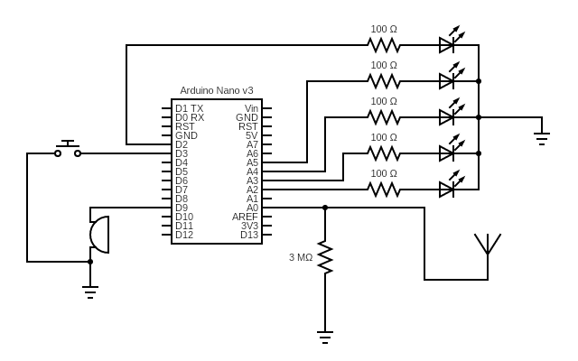

# EMF-Detector
EMF Detector maded with Arduino nano, it uses the 10Bit ADC on port A0 to detect weak electromagnetic fields and translate it into a signal in the buzzer and 5 leds indicator. Push button is used to change the sensitivity from 1 to 5.

